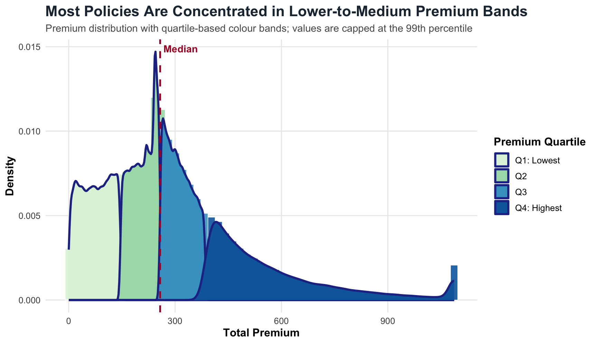
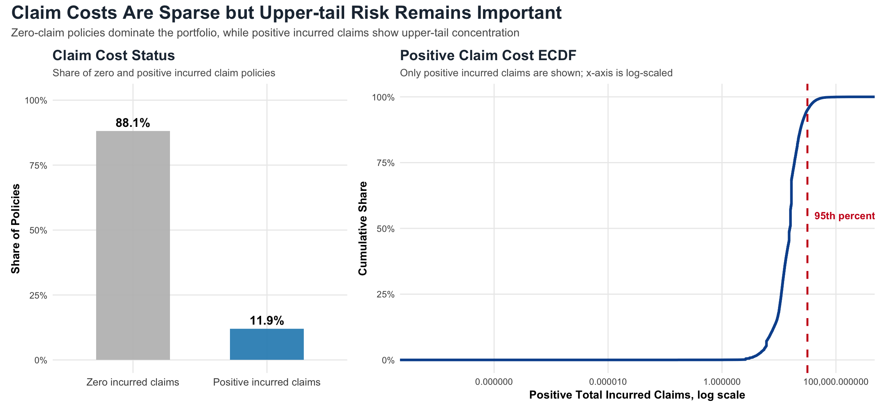
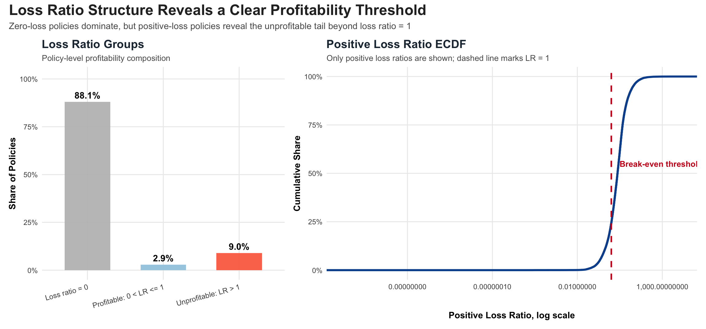
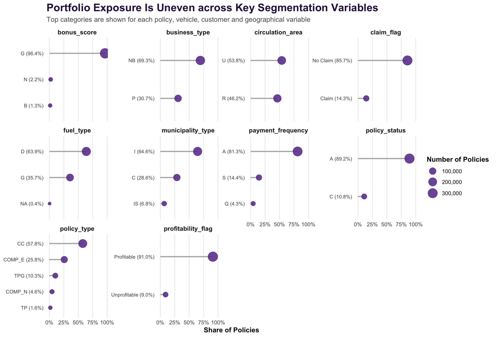
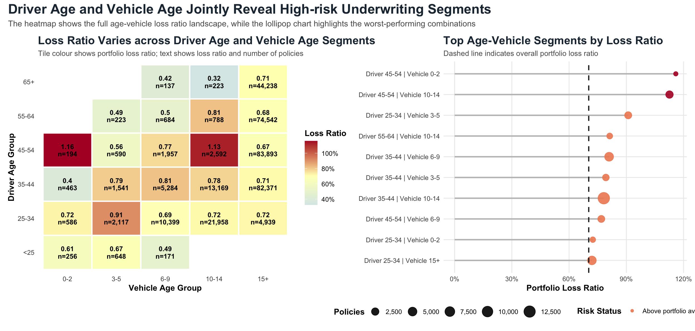
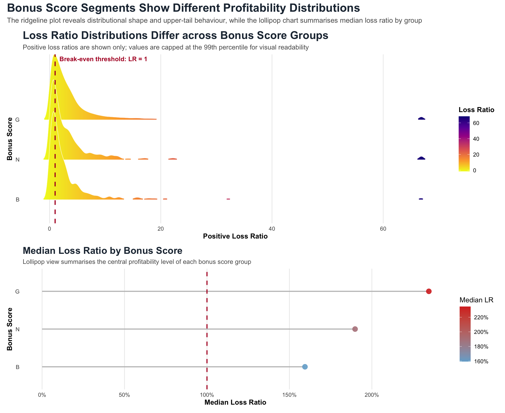
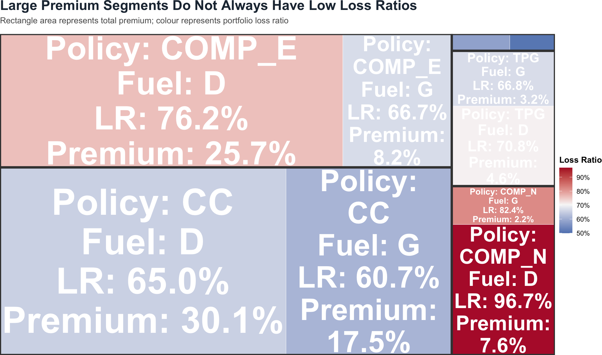
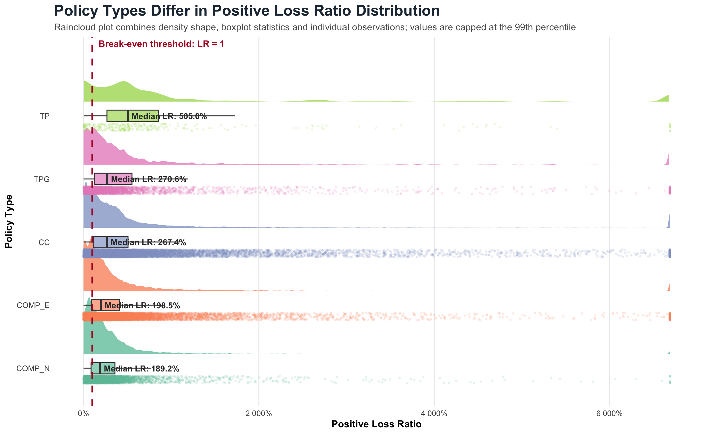
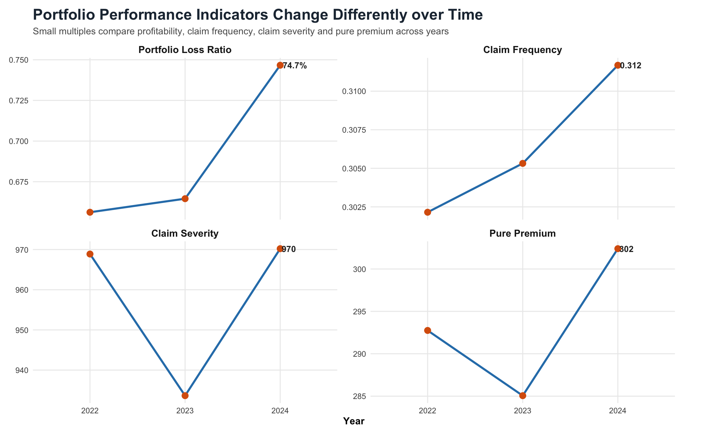
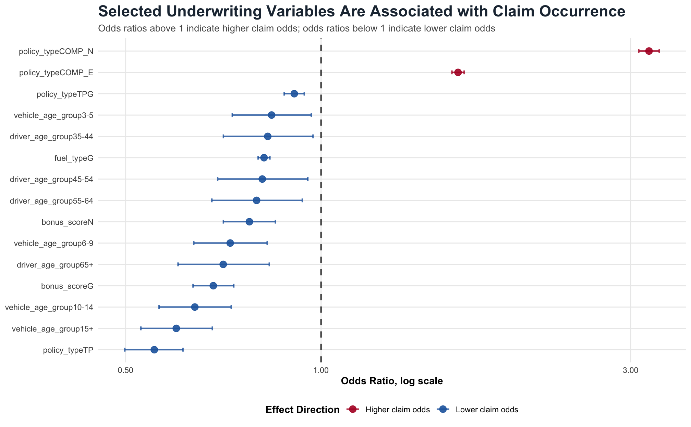

## Motor Insurance Portfolio Visual Analytics {background-gradient="linear-gradient(135deg, #203040, #2C7FB8)"}

### Segment-level Profitability, Claim Risk and Underwriting Insights

**HU YUE**  
ISSS608 Visual Analytics and Applications

 

::: notes
This cover slide introduces the executive summary presentation for the motor insurance portfolio visual analytics project. The main message is that aggregate portfolio averages are not sufficient. Although most policies generate no incurred claims, profitability risk is concentrated in claim-generating policies and selected high-risk underwriting segments.
:::

---

## Contents and Analytical Storyline

| Stage | Focus | Main Evidence |
|---|---|---|
| Portfolio structure | Premium, claim and loss ratio distribution | Density, ECDF, loss ratio groups |
| Segment risk | Where profitability differs | Heatmap, bubble plot, treemap |
| Distributional risk | How risk varies by group | Ridgeline, raincloud |
| Statistical validation | Whether patterns are supported | Kruskal-Wallis, logistic regression |
| Recommendations | What to act on | Segment-level monitoring |

::: notes
This slide outlines the analytical storyline. The presentation first summarises the overall portfolio structure, then moves to segment-level profitability patterns, distributional risk, statistical validation and final recommendations. The purpose is to convert visual patterns into practical underwriting and pricing insights.
:::

---

## Analytical Objective and Key Indicators

**Objective**

- Identify profitability and volatility patterns in the motor insurance portfolio.
- Examine how premium, claim cost, loss ratio and underwriting segments interact.
- Translate visual patterns into underwriting and pricing recommendations.

**Key indicators**

| Indicator | Meaning |
|---|---|
| Loss ratio | Incurred claims relative to premium |
| Claim frequency | Claim count relative to exposure |
| Claim severity | Average cost per claim |
| Pure premium | Incurred claims relative to exposure |

::: notes
This slide defines the analytical objective and the main insurance indicators used throughout the project. Loss ratio is the main profitability indicator, while claim frequency and claim severity help explain whether risk is driven by claim occurrence or claim cost. Pure premium summarises claim cost per exposure.
:::

---

## Portfolio Structure

{width=85%}

- Most policies are concentrated in lower-to-medium premium bands.
- A smaller group contributes to the higher-premium tail.
- Portfolio income is unevenly distributed across policies.

::: notes
The premium distribution shows that the portfolio income base is not evenly spread across policies. Most policies are concentrated in lower-to-medium premium bands, while a smaller group contributes higher premium. This motivates the need to examine profitability at segment level rather than relying only on aggregate premium.
:::

---

## Claim Costs Are Sparse but Tail Risk Remains Important

{width=82%}

**Finding:** Claim costs are highly sparse.  
**Evidence:** Around **88.1%** of policies have zero incurred claims, while **11.9%** have positive incurred claims.  
**Implication:** Positive-claim policies should be monitored separately because they contain upper-tail risk.

::: notes
This slide highlights the sparse nature of claim costs. Most policies generate no incurred claims, but the positive-claim portion still contains meaningful upper-tail risk. A small group of claim-generating policies can therefore have a material impact on portfolio profitability.
:::

---

## Loss Ratio Reveals a Clear Profitability Split

{width=82%}

**Finding:** Most policies have zero loss ratio, but the unprofitable tail remains important.  
**Evidence:** Around **88.1%** of policies have LR = 0, while **9.0%** have LR > 1.  
**Implication:** Aggregate averages may hide the risk embedded in claim-generating policies.

::: notes
The loss ratio structure confirms the same pattern as claim costs. Zero-loss policies dominate the portfolio, but the unprofitable positive-loss tail is important. Policies above the break-even threshold create profitability pressure and should be analysed separately from the full portfolio average.
:::

---

## Portfolio Exposure Concentration

::: columns
::: {.column width="78%"}

:::

::: {.column width="22%"}

**Finding**

Exposure is concentrated in a few dominant groups.

 

**Evidence**

- Bonus score `G`
- Fuel type `D`
- Policy type `CC`
- Business type `NB`

 

**Implication**

Large groups strongly affect aggregate results.

:::
:::

::: notes
The categorical composition chart shows that portfolio exposure is highly uneven across key segmentation variables. Bonus score G, fuel type D, business type NB and policy type CC dominate policy count. This means aggregate portfolio results are strongly influenced by these large groups, while smaller high-risk groups should be interpreted together with exposure size.
:::

---

## Driver Age and Vehicle Age Jointly Reveal High-risk Segments

{width=86%}

**Finding:** Risk is not explained by driver age or vehicle age alone.  
**Evidence:** Drivers aged **45–54** with vehicles aged **0–2** and **10–14** show high loss ratios.  
**Implication:** Underwriting segmentation should consider interaction effects.

::: notes
The heatmap shows that driver age and vehicle age should be considered jointly. Some combinations perform much worse than others, especially drivers aged 45–54 with very new or older vehicles. This suggests that underwriting rules based on single variables may miss important risk interactions.
:::

## Frequency-Severity Decomposition Explains Risk Mechanisms

**Finding:** Profitability pressure can come from different claim mechanisms.

| Mechanism | Interpretation | Underwriting implication |
|---|---|---|
| High frequency | Claims occur more often | Review claim occurrence drivers |
| High severity | Claims are costlier when they occur | Review coverage and large-loss exposure |
| High frequency + high severity | Most concerning risk profile | Prioritise for pricing and underwriting review |

**Implication:** Segments should not be managed only by loss ratio; claim frequency and severity should be separated.

::: notes
The frequency-severity decomposition shows that the same loss ratio can arise from different claim mechanisms. Some segments are risky because claims occur frequently, while others are risky because claims are severe when they occur. This distinction is important for choosing the right underwriting or pricing intervention.
:::

---

## Bonus Score Groups Show Distributional Differences

::: columns
::: {.column width="76%"}

:::

::: {.column width="24%"}

**Finding**

Positive loss ratios are right-skewed across bonus score groups.

 

**Evidence**

- Distributions show long upper tails.
- Some groups extend beyond the break-even threshold.
- Median level alone is not enough.

 

**Implication**

Bonus score should be assessed with tail behaviour and distributional spread, not only average loss ratio.

:::
:::

::: notes
The ridgeline plot shows that positive loss ratio distributions differ across bonus score groups. The key insight is not only the median level, but also the spread and upper-tail behaviour. This suggests that bonus score remains useful as a risk segmentation variable, but it should be combined with other underwriting factors and interpreted together with tail risk.
:::

---

## Premium Contribution and Loss Ratio Must Be Read Together

{width=82%}

**Finding:** Large premium segments do not always have low loss ratios.  
**Evidence:** Some large rectangles show moderate-to-high loss ratios.  
**Implication:** Large high-loss or above-average segments should be prioritised because they affect total portfolio profitability.

::: notes
The treemap links premium contribution and profitability in a single view. Rectangle size shows premium exposure, while colour shows loss ratio. This helps distinguish small high-risk groups from large segments that can have a stronger impact on aggregate profitability.
:::

---

## Policy Types Differ in Positive Loss Ratio Distribution

::: columns
::: {.column width="78%"}

:::

::: {.column width="22%"}

**Finding**

Positive loss ratios vary across policy types.

 

**Evidence**

- Different median levels
- Heavy right tails
- Wider dispersion in some policy types
- Some observations exceed break-even threshold

 

**Implication**

Policy type should be monitored using distributional risk, not only average loss ratio.

:::
:::

::: notes
The raincloud plot shows distributional differences across policy types. Because the chart focuses only on positive-loss policies, the loss ratios are much higher than the overall portfolio average. The important insight is that policy types differ not only in central tendency, but also in dispersion and upper-tail behaviour. This supports monitoring policy type using distributional visual analytics rather than relying only on average loss ratio.
:::

---

## Portfolio Performance Deteriorated in 2024

{width=82%}

**Finding:** Portfolio performance worsened in 2024.  
**Evidence:** Loss ratio increased to around **74.7%**, and claim frequency rose to around **0.312**.  
**Implication:** The deterioration appears to reflect both claim occurrence and claim cost pressure.

::: notes
The time-series small multiples show that portfolio performance deteriorated in 2024. Loss ratio, claim frequency, claim severity and pure premium all increased. This suggests that worsening profitability was not caused by one factor alone, but by both claim occurrence and claim cost pressure.
:::

---

## Statistical Validation Supports the Visual Findings

::: columns
::: {.column width="58%"}

:::

::: {.column width="42%"}

**Kruskal-Wallis tests**

- Policy type differs significantly in positive loss ratio distribution.
- Bonus score also differs significantly.
- Effect sizes are small, so practical interpretation is required.

 

**Logistic regression**

- Claim occurrence rate is around **14.3%**.
- Some policy types show higher claim odds.
- Some vehicle age groups, fuel types and bonus score groups show lower claim odds.

 

**Implication**

Statistical evidence supports the visual findings, but decisions should combine p-values, effect size, exposure and business context.

:::
:::

::: notes
The statistical validation supports the visual findings. Kruskal-Wallis tests show that positive loss ratio distributions differ across policy type and bonus score, although the effect sizes are small. Logistic regression further shows that selected underwriting variables are associated with claim occurrence. These results should be treated as supporting evidence rather than a complete pricing model.
:::

---

## Recommendations and Conclusion

**Recommended actions**

- Move from aggregate monitoring to **segment-level profitability monitoring**.
- Prioritise high-risk **driver age × vehicle age** combinations.
- Separate **frequency-driven** and **severity-driven** risks.
- Review large premium segments with above-average loss ratios.
- Investigate the 2024 deterioration in loss ratio, frequency and severity.

**Overall conclusion:**  
Portfolio profitability is shaped by interactions among policy, vehicle, driver and claim characteristics.

::: notes
The overall conclusion is that portfolio risk is uneven and segment-specific. High-risk areas emerge from interactions among driver age, vehicle age, policy type, fuel type, bonus score and claim behaviour. Future pricing and underwriting decisions should combine visual analytics, statistical validation and business judgement.
:::